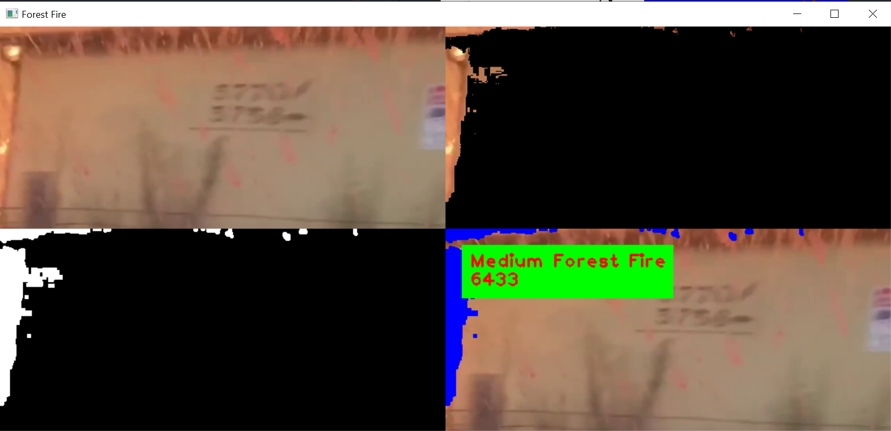
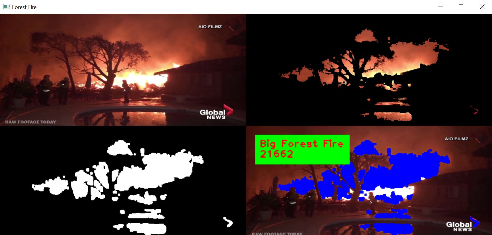

# Forest Fire Segmentation

## Description

Fire segmentation in your forest fire video with GUI application based. \
You can use this code for another segmentation, but you must have a color space method, value upper bound, value lower bound and your video.

## Recommended Value

### LAB

| No  | Lower     | Upper       |
| --- | --------- | ----------- |
| 1   | 82 0 159  | 255 255 255 |
| 2   | 157 0 148 | 255 255 255 |
| 3   | 112 0 160 | 255 255 255 |
| 4   | 114 0 168 | 255 182 255 |
| 5   | 203 0 112 | 255 255 255 |
| 6   | 117 0 156 | 255 255 255 |
| 7   | 134 0 149 | 255 240 255 |

### HSV

| No  | Lower     | Upper       |
| --- | --------- | ----------- |
| 1   | 0 0 148   | 179 255 255 |
| 2   | 6 0 216   | 98 255 255  |
| 3   | 0 143 132 | 179 255 255 |
| 4   | 0 0 210   | 50 255 255  |
| 5   | 0 0 198   | 179 255 255 |
| 6   | 2 48 165  | 151 255 255 |
| 7   | 1 29 181  | 137 255 255 |

### YCrCb

| No  | Lower     | Upper       |
| --- | --------- | ----------- |
| 1   | 103 0 0   | 255 255 255 |
| 2   | 152 0 0   | 255 255 112 |
| 3   | 98 0 0    | 255 255 86  |
| 4   | 121 103 0 | 255 255 255 |
| 5   | 130 0 70  | 255 255 255 |
| 6   | 119 0 0   | 255 255 151 |
| 7   | 121 21 14 | 255 255 193 |

## Installation

```bash
$ git clone https://github.com/hafidh561/Forest-Fire-Segmentation.git
```

### Installation Python

```bash
# Python version 3.8 or more
$ pip install -r requirements.txt

# Download video
# Make sure put your video in ./test_video
$ python download_video.py
```

### Installation Docker

```bash
# Newest docker version
$ docker build -t hafidh561/forest-fire-segmentation:1.0 .
```

## Usage

### Usage Python

```bash
$ python app.py -h
usage: app.py [-h] [-l LOWER [LOWER ...]] [-u UPPER [UPPER ...]] [-m METHOD] [-haf HIGH_AREA_FIRE] [-maf MEDIUM_AREA_FIRE] [-laf LOW_AREA_FIRE]
              [-v VIDEO] [-ffv FOREST_FIRE_VIDEO]

optional arguments:
  -h, --help            show this help message and exit
  -l LOWER [LOWER ...], --lower LOWER [LOWER ...]
                        Input your lower bound value
  -u UPPER [UPPER ...], --upper UPPER [UPPER ...]
                        Input your upper bound value
  -m METHOD, --method METHOD
                        Input your color space method
  -haf HIGH_AREA_FIRE, --high-area-fire HIGH_AREA_FIRE
                        Input your minimal value to detect high area fire
  -maf MEDIUM_AREA_FIRE, --medium-area-fire MEDIUM_AREA_FIRE
                        Input your minimal value to detect medium area fire
  -laf LOW_AREA_FIRE, --low-area-fire LOW_AREA_FIRE
                        Input your minimal value to detect low area fire
  -v VIDEO, --video VIDEO
                        Input your video source
  -ffv FOREST_FIRE_VIDEO, --forest-fire-video FOREST_FIRE_VIDEO
                        Forest fire video True or False

# Example arguments input
$ python app.py -l 121 21 14 -u 255 255 193 -m ycrcb -haf 7000 -maf 3500 -laf 100 -v ./src/video2.mp4 -ffv true
```

### Usage Docker

#### Prerequisite for Windows

1. Download and install [VcXsrv](https://sourceforge.net/projects/vcxsrv/)
2. Run VcXsrv before run this docker app

#### Prerequisite for Linux

```bash
# Expose your xhost
$ xhost +local:docker

# When you finish, you can return the access control by using the following
$ xhost -local:docker

# Add environment variables
$ XSOCK=/tmp/.X11-unix
$ XAUTH=/tmp/.docker.xauth

# Create the authentication files
$ touch /tmp/.docker.xauth

# Create permission
$ xauth nlist $DISPLAY | sed -e 's/^..../ffff/' | xauth -f $XAUTH nmerge -
```

```bash
$ docker run --rm -e DISPLAY=<YOUR LOCAL IP ADDRESS>:0 hafidh561/forest-fire-segmentation:1.0 -h
usage: app.py [-h] [-l LOWER [LOWER ...]] [-u UPPER [UPPER ...]] [-m METHOD]
              [-haf HIGH_AREA_FIRE] [-maf MEDIUM_AREA_FIRE]
              [-laf LOW_AREA_FIRE] [-v VIDEO] [-ffv FOREST_FIRE_VIDEO]

optional arguments:
  -h, --help            show this help message and exit
  -l LOWER [LOWER ...], --lower LOWER [LOWER ...]
                        Input your lower bound value
  -u UPPER [UPPER ...], --upper UPPER [UPPER ...]
                        Input your upper bound value
  -m METHOD, --method METHOD
                        Input your color space method
  -haf HIGH_AREA_FIRE, --high-area-fire HIGH_AREA_FIRE
                        Input your minimal value to detect high area fire
  -maf MEDIUM_AREA_FIRE, --medium-area-fire MEDIUM_AREA_FIRE
                        Input your minimal value to detect medium area fire
  -laf LOW_AREA_FIRE, --low-area-fire LOW_AREA_FIRE
                        Input your minimal value to detect low area fire
  -v VIDEO, --video VIDEO
                        Input your video source
  -ffv FOREST_FIRE_VIDEO, --forest-fire-video FOREST_FIRE_VIDEO
                        Forest fire video True or False

# Example arguments input
$ docker run --rm -e DISPLAY=192.168.0.2:0 hafidh561/forest-fire-segmentation:1.0 -l 121 21 14 -u 255 255 193 -m hsv -haf 7000 -maf 3500 -laf 100 -v ./src/video2.mp4 -ffv true

# For Operating System Windows
$ docker run --rm -e DISPLAY=<YOUR LOCAL IP ADDRESS>:0 hafidh561/forest-fire-segmentation:1.0

# For Operating System Linux
$ docker run --rm -e DISPLAY=$DISPLAY hafidh561/forest-fire-segmentation:1.0
```

## Screenshots






## Report Article

-   [Indonesian Language](https://docs.google.com/document/d/1jCI-Ev_9UF6dTyDjWhQDyNux5kJUfovuri5XxY9DmWY/edit?usp=sharing)

## License

[MIT LICENSE](./LICENSE)

© Developed by [hafidh561](https://github.com/hafidh561) - Internship at Nodeflux
