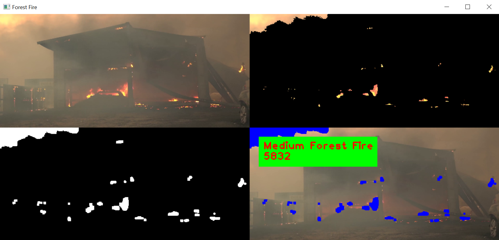

# Forest Fire Segmentation

## Description

Fire segmentation in your video forest fire with GUI application based. \
You can use this code for other segmentation, but you must have color space method, value upper bound, value lower bound and your video for segmentation.

## Recommended Value

1. **LAB**
    1. Lower = [82, 0, 159] \
       Upper = [255, 255, 255]
    2. Lower = [157, 0, 148] \
       Upper = [255, 255, 255]
    3. Lower = [112, 0, 160] \
       Upper = [255, 255, 255]
    4. Lower = [114, 0, 168] \
       Upper = [255, 182, 255]
    5. Lower = [203, 0, 112] \
       Upper = [255, 255, 255]
    6. Lower = [117, 0, 156] \
       Upper = [255, 255, 255]
    7. Lower = [134, 0, 149] \
       Upper = [255, 240, 255]
2. **HSV**
    1. Lower = [0, 0, 148] \
       Upper = [179, 255, 255]
    2. Lower = [6, 0, 216] \
       Upper = [98, 255, 255]
    3. Lower = [0, 143, 132] \
       Upper = [179, 255, 255]
    4. Lower = [0, 0, 210] \
       Upper = [50, 255, 255]
    5. Lower = [0, 0, 198] \
       Upper = [179, 255, 255]
    6. Lower = [2, 48, 165] \
       Upper = [151, 255, 255]
    7. Lower = [1, 29, 181] \
       Upper = [137, 255, 255]
3. **YCrCb**
    1. Lower = [103, 0, 0] \
       Upper = [255, 255, 255]
    2. Lower = [152, 0, 0] \
       Upper = [255, 255, 112]
    3. Lower = [98, 0, 0] \
       Upper = [255, 255, 86]
    4. Lower = [121, 103, 0] \
       Upper = [255, 255, 255]
    5. Lower = [130, 0, 70] \
       Upper = [255, 255, 255]
    6. Lower = [119, 0, 0] \
       Upper = [255, 255, 151]
    7. Lower = [121, 21, 14] \
       Upper = [255, 255, 193]

## Installation

### Installation Python

```bash
$ pip install -r requirement.txt
$ # this is command optional, just for example video source \
$ python download_video.py
```

### Installation Docker

```bash
$ docker build -t hafidh561/forest-fire-segmentation:1.0 .
```

## Usage

### Usage Python

```bash
$ python app.py -h
usage: app.py [-h] [-l LOWER [LOWER ...]] [-u UPPER [UPPER ...]] [-m METHOD] [-v VIDEO]

optional arguments:
  -h, --help            show this help message and exit
  -l LOWER [LOWER ...], --lower LOWER [LOWER ...]
                        Input your lower bound value
  -u UPPER [UPPER ...], --upper UPPER [UPPER ...]
                        Input your upper bound value
  -m METHOD, --method METHOD
                        Input your color space method
  -v VIDEO, --video VIDEO
                        Input your video source

$ # Example arguments input
$ python app.py -l 121 21 14 -u 255 255 193 -m ycrcb -v ./src/video2.mp4
```

### Usage Docker

```bash
$ docker run --rm -e hafidh561/forest-fire-segmentation:1.0 -h
usage: app.py [-h] [-l LOWER [LOWER ...]] [-u UPPER [UPPER ...]] [-m METHOD]
              [-v VIDEO]

optional arguments:
  -h, --help            show this help message and exit
  -l LOWER [LOWER ...], --lower LOWER [LOWER ...]
                        Input your lower bound value
  -u UPPER [UPPER ...], --upper UPPER [UPPER ...]
                        Input your upper bound value
  -m METHOD, --method METHOD
                        Input your color space method
  -v VIDEO, --video VIDEO
                        Input your video source

$ # Example arguments input
$ docker run --rm -e DISPLAY=192.168.0.2:0 hafidh561/forest-fire-segmentation:1.0 -l 121 21 14 -u 255 255 193 -m hsv -v ./src/video2.mp4

$ # For Operating System Windows
$ docker run --rm -e DISPLAY=<your local ip address> hafidh561/forest-fire-segmentation:1.0

$ # For Operating System Linux
$ docker run --rm -e DISPLAY=$DISPLAY hafidh561/forest-fire-segmentation:1.0
```

## Screenshots





## License

See [LICENSE](./LICENSE).

## Changelog

-   **1.0** Forest Fire Segmentation

© Developed by [hafidh561](https://github.com/hafidh561).
